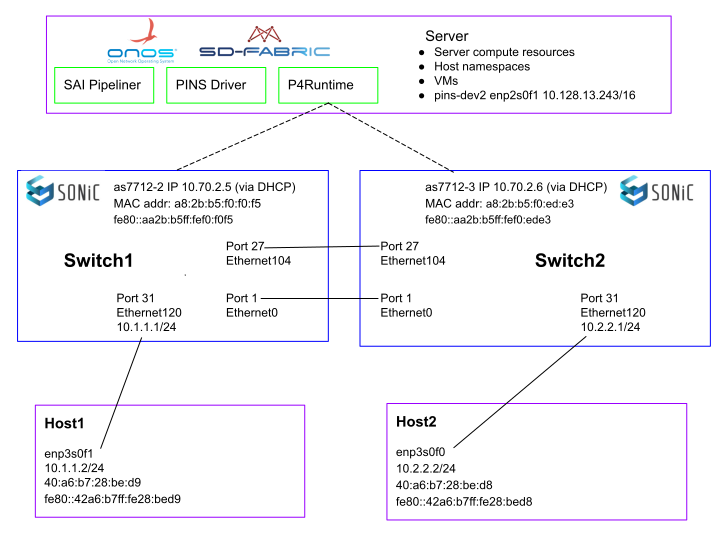

## Exercise 2 - Configure Tutorial Network

The tutorial configuration consists of a server (it can be a laptop), two switches, and two hosts, as shown in the following diagram. There are a variety of ways that you could implement this configuration, such as using two servers or using namespaces, lxc containers, or VMs on a single server. For simplicity, we show two separate hosts.

This exercise will set up the host interfaces and internal routes. Then you will set up the SONiC switch interfaces. You will not be able to ping between the two hosts because the routes between the switches do not exist yet (we have not configured BGP or any other embedded control protocol).


### Figure 1 - Tutorial Sample Configuration



### Verify Connections

Verify that the switch is wired correctly to the hosts and that the speed within each pair of connected interfaces matches. 


1. Login (`ssh`) to each switch and check the interface speed and that the expected interfaces are up. Reference: [SONiC Interfaces command reference](https://github.com/Azure/sonic-utilities/blob/master/doc/Command-Reference.md#interfaces)

    ```
    Switch$ show interfaces status

      Interface            Lanes    Speed    MTU    FEC          Alias    Vlan    Oper    Admin    Type    Asym PFC

    -----------  ---------------  -------  -----  -----  -------------  ------  ------  -------  ------  ----------
      Ethernet0      49,50,51,52     100G   9100    N/A   hundredGigE1  routed      up       up     N/A         N/A
      Ethernet4      53,54,55,56     100G   9100    N/A   hundredGigE2  routed    down       up     N/A         N/A
    …
    Ethernet100  117,118,119,120     100G   9100    N/A  hundredGigE26  routed    down       up     N/A         N/A
    Ethernet104  121,122,123,124     100G   9100    N/A  hundredGigE27  routed      up       up     N/A         N/A
    Ethernet108  125,126,127,128     100G   9100    N/A  hundredGigE28  routed    down       up     N/A         N/A
    Ethernet112          1,2,3,4     100G   9100    N/A  hundredGigE29  routed    down       up     N/A         N/A
    Ethernet116          5,6,7,8     100G   9100    N/A  hundredGigE30  routed    down       up     N/A         N/A
    Ethernet120       9,10,11,12      40G   9100    N/A  hundredGigE31  routed      up       up     N/A         N/A
    Ethernet124      13,14,15,16     100G   9100    N/A  hundredGigE32  routed    down       up     N/A         N/A
    ```


2. If an expected connection is down, login (`ssh`) to the host(s). One potential problem is that the host interface speed does not match the switch interface speed. Check the speed on the host and, if necessary, change the switch’s interface speed to match the host.

    ```
    host1$ ethtool enp3s0f1
    host2$ ethtool enp3s0f0
    switch1$ sudo config interface speed Ethernet120 40000
    switch2$ sudo config interface speed Ethernet120 40000
    ```


3. If the links are not up, set them to up.

    ```
    host1$ sudo ip link set up enp3s0f1
    host2$ sudo ip link set up enp3s0f0
    ```


4. Verify on both switches.

    ```
    switch1$ show interfaces status
    switch2$ show interfaces status
    ```


### Host Interfaces


1. On each host, set a new IP address and the outgoing route as needed for your network configuration (e.g., if using namespaces, set up a default route using the command, `ip route add default via 10.2.1.0`). 
2. Then verify the IP address and route.

Examples:


```
host1$ sudo ip address add 10.1.1.2/24 dev enp3s0f1
host1$ sudo ip route add 10.2.2.0/24 via 10.1.1.1
host1$ ip address
   2: enp3s0f1: <BROADCAST,MULTICAST,UP,LOWER_UP> mtu 1500 qdisc mq state UP group default qlen 1000
    link/ether 40:a6:b7:28:be:d9 brd ff:ff:ff:ff:ff:ff
    inet 10.1.1.2/24 scope global enp3s0f1
       valid_lft forever preferred_lft forever
    inet6 fe80::42a6:b7ff:fe28:bed9/64 scope link
       valid_lft forever preferred_lft forever
host1$ ip route
    10.1.1.0/24 dev enp3s0f1 proto kernel scope link src 10.1.1.2
    10.2.2.0/24 via 10.1.1.1 dev enp3s0f1
host2$ sudo ip address add 10.2.2.2/24 dev enp3s0f0
host2$ sudo ip route add 10.1.1.0/24 via 10.2.2.1
host2$ ip address
   2: enp3s0f0: <BROADCAST,MULTICAST,UP,LOWER_UP> mtu 1500 qdisc mq state UP group default qlen 1000
    link/ether 40:a6:b7:28:be:d8 brd ff:ff:ff:ff:ff:ff
    inet 10.2.2.2/24 scope global enp3s0f0
       valid_lft forever preferred_lft forever
    inet6 fe80::42a6:b7ff:fe28:bed8/64 scope link
       valid_lft forever preferred_lft forever
host2$ ip route
    10.1.1.0/24 via 10.2.2.1 dev enp3s0f0
    10.2.2.0/24 dev enp3s0f0 proto kernel scope link src 10.2.2.2
```


### Switch Interfaces


1. Configure the switch interfaces with IP addresses in the same subnet as the IP addresses in your hosts. If you need to reboot your switches in exercises 3 or 4, remember to repeat this step.

    ```
    switch1$ sudo config interface ip add Ethernet120 10.1.1.1/24
    switch2$ sudo config interface ip add Ethernet120 10.2.2.1/24
    ```


2. Verify on both switches.

    ```
    switch1$ show ip interfaces
    Interface    Master    IPv4 address/mask    Admin/Oper    BGP Neighbor    Neighbor IP
    -----------  --------  -------------------  ------------  --------------  -------------
    Ethernet120            10.1.1.1/24          up/up         N/A             N/A

    switch2$ show ip interfaces
    Interface    Master    IPv4 address/mask    Admin/Oper    BGP Neighbor    Neighbor IP
    -----------  --------  -------------------  ------------  --------------  -------------
    Ethernet120            10.2.2.1/24          up/up         N/A             N/A
    ```


3. Clearing counters will make it easier to monitor the traffic in this exercise.

    ```
    switch1$ sonic-clear counters
    switch2$ sonic-clear counters
    ```


4. We _cannot_ ping the new addresses because we have not set up a route yet.
    ```
    host1$ ping 10.2.2.2  (doesn’t work)
    host2$ ping 10.1.1.2  (doesn’t work)
    ```

5. Check interface counters and observe that the pings work in one direction.

    ```
    switch1$ show interfaces counters
    switch2$ show interfaces counters
    ```
