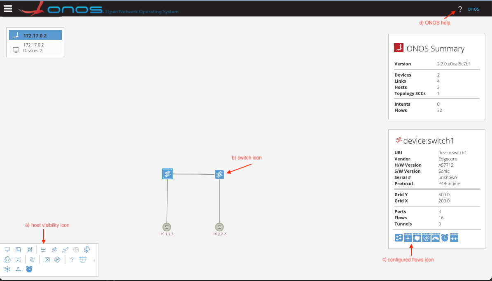
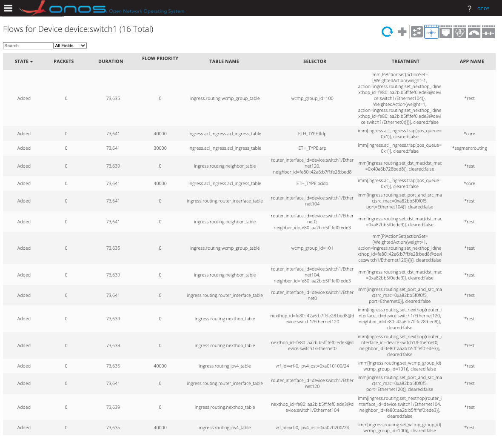
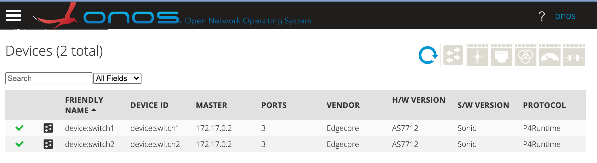
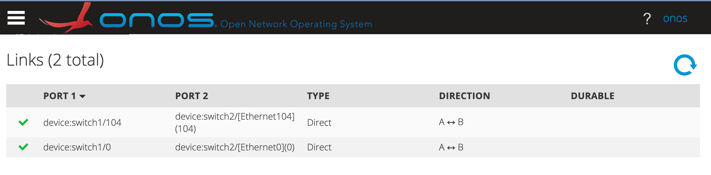
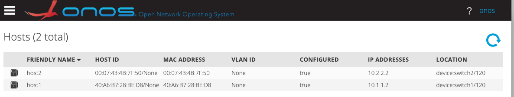
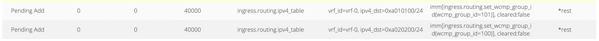

## Exercise 4 - Deploy and Configure ONOS

With the topology in [Exercise2 - Figure 1](../Exercise2#figure-1---tutorial-sample-configuration), you will use the ONOS Controller and REST API to configure the pipeline and routes in this exercise. You will be able to ping between your two hosts through the PINS fabric at the end of this exercise.


### Starting From Scratch


This section contains tips to help you start with a clean system, especially if you have run through these exercises previously. Don’t worry about simply going from Exercise 3, using the `p4rt-client`, to this exercise using ONOS. ONOS will clear the pipeline from the previous activity. 


#### VRF


1. Check the `p4rt.sh` file and make sure it has the option `-default_vrf_id=vrf-0`, which ONOS currently needs.

    ```
    Switch$ docker exec p4rt cat /usr/bin/p4rt.sh
    P4RT_ARGS=" -default_vrf_id=vrf-0 --alsologtostderr --logbuflevel=-1 "
    ```


2. If you do not see the VRF option, add it with the following command, verify, reload the configuration, and follow the re-configuration steps in the next section.

    ```
    Switch$ docker exec p4rt sed -i 's/P4RT_ARGS="/P4RT_ARGS=" -default_vrf_id=vrf-0/' /usr/bin/p4rt.sh
    Switch$ docker exec p4rt cat /usr/bin/p4rt.sh
    Switch$ sudo config reload -yf
    ```


3. After this exercise, if you go back to the `p4rt-client` or non-ONOS controller, you will need to remove the VRF option:

    ```
    Switch$ docker exec p4rt sed -i 's/ -default_vrf_id=vrf-0//g' /usr/bin/p4rt.sh
    ```


#### Switch Reload or Reboot

If you reload the configuration on your switches or reboot them, review [Exercise 2](../Exercise2). Here is a summary of the commands you may need. 


1. Are there any custom interface requirements, such as speed?

    ```
    switch1$ sudo config interface speed Ethernet120 40000
    switch2$ sudo config interface speed Ethernet120 40000
    ```


2. Reconfigure the interface IP address.

    ```
    switch1$ sudo config interface ip add Ethernet120 10.1.1.1/24
    switch2$ sudo config interface ip add Ethernet120 10.2.2.1/24
    ```


3. Verify switches and hosts, as you did in Exercise 2.

    ```
    switch1$ show interfaces status
    switch1$ show ip interfaces
    switch2$ show interfaces status
    switch2$ show ip interfaces
    host1$ ip address
    host1$ ip route
    host2$ ip address
    host2$ ip route
    ```


#### ONOS Already Running

If you have already done this exercise, you will need to stop ONOS.


```
Server$ docker kill onos
```


### Software for this Exercise

There are eleven sample configuration files used in this exercise found in the PINS tutorials repository: `config-tutorial.json, flow-objectives.sh, forward-switch1-host1.json, forward-switch1-host2.json, forward-switch2-host1.json, forward-switch2-host2.json, next-switch1-host1.json, next-switch1-host2.json, next-switch2-host1.json, next-switch2-host2.json, `and `onf.p4info.pb.txt.` 


1. Download the files for Exercise 4 or clone the repository, as described in [Software Used in Tutorial](../README.md#software-used-in-tutorial).
2. Use the following command to pull and start ONOS with the PINS driver and SAI pipeliner installed.

    ```
    Server$ docker run --rm -t -d -p 8181:8181 -p 8101:8101 -p 5005:5005 -p 830:830 --pull always --name onos dmoro92/pins-onos:0.0.1
    ```


3. Verify that ONOS is running.

    ```
    Server$ docker ps
    ```


OPTIONAL: You can use `ssh` port mapping to enable `localhost` if you are running ONOS on a remote machine. Then subsequent commands can use `localhost` instead of the full IP address.

Example: `ssh -N -L 8181:localhost:8181 -L 8101:localhost:8101 pins-dev2`


### Configure ONOS 

The sample JSON configuration file, `config-tutorial.json`, sets up routes through both switch connections, Ethernet0 and Ethernet104. You will need to customize the configuration file for your network topology. The file contains these elements:


* _devices_: for each device in the network, define the management interface, routing, and port configuration (port discovery via gNMI is currently not supported for PINS devices).
    * _ports_: for every port in the topology, specify the PORT_ID as appears in the SONiC config DB.
* _hosts_: host configuration is optional because hosts can be discovered by triggering an ARP request.

1. Edit the configuration file and push it to the network. There is no output unless the command fails.

    ```
    Server$ vim config-tutorial.json
    Server$ curl --fail -sSL --user karaf:karaf -X POST http://${YOUR_IP}:8181/onos/v1/network/configuration -H Content-type:application/json -d@config-tutorial.json
    ```


2. If you check the Redis database on your switches, only the ACL entries are set up.

    ```
    Switch$ redis-cli keys P4*
    1) "P4RT:ACL_ACL_INGRESS_TABLE:{\"match/ether_type\":\"0x88cc&0xffff\",\"priority\":40001}"
    2) "P4RT:ACL_ACL_INGRESS_TABLE:{\"match/ether_type\":\"0x0806&0xffff\",\"priority\":30001}"
    3) "P4RT:ACL_ACL_INGRESS_TABLE:{\"match/ether_type\":\"0x8942&0xffff\",\"priority\":40001}"
    4) "P4RT:DEFINITION:ACL_ACL_INGRESS_TABLE"
    ```


    NOTE: If your switch does not support ACLs, you will need to modify the P4 program and recompile it for your switch so that the output file, `onf.p4info.pb.txt`, does not contain ACLs.

3. Verify that the configuration that you loaded is correct using the ONOS CLI. The output should match `config-tutorial.json`, although it may be in a slightly different order.

    ```
    Server$ docker exec -it onos /root/onos/apache-karaf-4.2.9/bin/client
    onos> netcfg
    {
      "devices" : {
        "device:switch1" : {
          "basic" : {
            "managementAddress" : "grpc://10.70.2.5:9559?device_id=183807201",
            "manufacturer" : "Edgecore",
            "hwVersion" : "AS7712",
            "driver" : "sonic",
            "pipeconf" : "org.onosproject.pipelines.sai",
            "locType" : "grid",
            "gridX" : 200,
            "gridY" : 600
          },
          "ports" : {
            "0" : {
              "enabled" : true,
              "name" : "Ethernet0",
              "number" : 0,
              "removed" : false,
              "speed" : 100000,
              "type" : "copper"
            },
            "104" : {
              "enabled" : true,
              "name" : "Ethernet104",
              "number" : 104,
              "removed" : false,
              "speed" : 100000,
              "type" : "copper"
            },
            "120" : {
              "enabled" : true,
              "name" : "Ethernet120",
              "number" : 120,
              "removed" : false,
              "speed" : 40000,
              "type" : "copper"
            }
          }
        },
        "device:switch2" : {
          "basic" : {
            "managementAddress" : "grpc://10.70.2.6:9559?device_id=183807201",
            "manufacturer" : "Edgecore",
            "hwVersion" : "AS7712",
            "driver" : "sonic",
            "pipeconf" : "org.onosproject.pipelines.sai",
            "locType" : "grid",
            "gridX" : 400,
            "gridY" : 600
          },
          "ports" : {
            "0" : {
              "enabled" : true,
              "name" : "Ethernet0",
              "number" : 0,
              "removed" : false,
              "speed" : 100000,
              "type" : "copper"
            },
            "104" : {
              "enabled" : true,
              "name" : "Ethernet104",
              "number" : 104,
              "removed" : false,
              "speed" : 100000,
              "type" : "copper"
            },
            "120" : {
              "enabled" : true,
              "name" : "Ethernet120",
              "number" : 120,
              "removed" : false,
              "speed" : 100000,
              "type" : "copper"
            }
          }
        }
      },
      "layouts" : { },
      "hosts" : {
        "00:07:43:4B:7F:50/None" : {
          "basic" : {
            "name" : "host2",
            "allowed" : true,
            "locType" : "grid",
            "gridX" : 400,
            "gridY" : 800,
            "ips" : [ "10.2.2.2" ],
            "locations" : [ "device:switch2/120" ]
          }
        },
        "40:A6:B7:28:BE:D8/None" : {
          "basic" : {
            "name" : "host1",
            "allowed" : true,
            "locType" : "grid",
            "gridX" : 200,
            "gridY" : 800,
            "ips" : [ "10.1.1.2" ],
            "locations" : [ "device:switch1/120" ]
          }
        }
      },
      "links" : { },
      "apps" : {
        "org.onosproject.provider.lldp" : {
          "suppression" : {
            "deviceTypes" : [ "ROADM", "OTN", "FIBER_SWITCH", "OPTICAL_AMPLIFIER", "OLS", "TERMINAL_DEVICE" ],
            "annotation" : "{\"no-lldp\":null}"
          }
        }
      },
      "ports" : { },
      "regions" : { }
    }
    ```


4. You are not able to ping between your hosts because the flow objectives have not been set up.

    ```
    host1$ ping 10.2.2.2  (doesn't work)
    host2$ ping 10.1.1.2  (doesn't work)
    ```


### Using Flow Objectives and the REST API

We will show you two ways to access the REST API to create flow objectives: `curl` and the Swagger UI. 


#### Curl Example

The script file, `flow-objectives.sh,` contains eight `curl` commands, one for each flow objective. The corresponding JSON files contain commands to set up routes in both directions between the hosts through both switches.

Example `curl` command to set up part of a flow objective:


```
curl -X POST -u karaf:karaf -H "Content-Type: application/json" -d @forward-switch1-host1.json http://10.128.13.243:8181/onos/v1/flowobjectives/device:switch1/forward?appId=org.onosproject.rest
```


1. Edit the corresponding eight JSON files (e.g., `forward-switch1-host1.json `and` next-switch2-host2.json)` to match your network topology.

    ```
    Server$ vim forward-*.json next-*.json
    ```


2. Run the flow objectives script. There is no output unless the script fails.

    ```
    Server$ ./flow-objectives.sh
    ```


3. Validate the Redis database and ONOS setup, as described in subsequent sections.


#### Swagger UI Example (optional alternative)

If you are familiar with swagger docs and would prefer to use them instead of the provided script, here are the steps you could follow.


1. Point your browser to `http://${YOUR_IP}:8181/onos/v1/docs`
2. Use `flowobjective/{deviceid}/forward` and `flowobjective/{deviceid}/next`
3. Choose an `appID.` We used `org.onosproject.rest` in our sample script.
4. Choose the `deviceIDs` for your devices and make sure you use the same identifier in the JSON streams. For example, we used `device:switch1` and `device:switch2`.
5. Create your JSON streams. Be sure that the `nextId` in the forward stream matches the `id` in the next stream. See the eight JSON example files that we used. 


### Validate the Redis Database

Using `redis-cli` on the individual switches, you can see the P4RT additions to the SONiC database.


```
Switch$ redis-cli keys P4*
 1) "P4RT:FIXED_IPV4_TABLE:{\"match/ipv4_dst\":\"10.1.1.0/24\",\"match/vrf_id\":\"\"}"
 2) "P4RT:FIXED_WCMP_GROUP_TABLE:{\"match/wcmp_group_id\":\"101\"}"
 3) "P4RT:ACL_ACL_INGRESS_TABLE:{\"match/ether_type\":\"0x0806&0xffff\",\"priority\":30001}"
 4) "P4RT:FIXED_ROUTER_INTERFACE_TABLE:{\"match/router_interface_id\":\"device:switch1/Ethernet104\"}"
 5) "P4RT:ACL_ACL_INGRESS_TABLE:{\"match/ether_type\":\"0x8942&0xffff\",\"priority\":40001}"
 6) "P4RT:FIXED_ROUTER_INTERFACE_TABLE:{\"match/router_interface_id\":\"device:switch1/Ethernet0\"}"
 7) "P4RT:FIXED_NEIGHBOR_TABLE:{\"match/neighbor_id\":\"fe80::aa2b:b5ff:fef0:ede3\",\"match/router_interface_id\":\"device:switch1/Ethernet0\"}"
 8) "P4RT:FIXED_NEIGHBOR_TABLE:{\"match/neighbor_id\":\"fe80::aa2b:b5ff:fef0:ede3\",\"match/router_interface_id\":\"device:switch1/Ethernet104\"}"
 9) "P4RT:FIXED_IPV4_TABLE:{\"match/ipv4_dst\":\"10.2.2.0/24\",\"match/vrf_id\":\"\"}"
10) "P4RT:FIXED_WCMP_GROUP_TABLE:{\"match/wcmp_group_id\":\"100\"}"
11) "P4RT:DEFINITION:ACL_ACL_INGRESS_TABLE"
12) "P4RT:FIXED_NEXTHOP_TABLE:{\"match/nexthop_id\":\"fe80::aa2b:b5ff:fef0:ede3@device:switch1/Ethernet0\"}"
13) "P4RT:ACL_ACL_INGRESS_TABLE:{\"match/ether_type\":\"0x88cc&0xffff\",\"priority\":40001}"
14) "P4RT:FIXED_NEXTHOP_TABLE:{\"match/nexthop_id\":\"fe80::aa2b:b5ff:fef0:ede3@device:switch1/Ethernet104\"}"
15) "P4RT:FIXED_NEXTHOP_TABLE:{\"match/nexthop_id\":\"fe80::42a6:b7ff:fe28:bed8@device:switch1/Ethernet120\"}"
16) "P4RT:FIXED_NEIGHBOR_TABLE:{\"match/neighbor_id\":\"fe80::42a6:b7ff:fe28:bed8\",\"match/router_interface_id\":\"device:switch1/Ethernet120\"}"
17) "P4RT:FIXED_ROUTER_INTERFACE_TABLE:{\"match/router_interface_id\":\"device:switch1/Ethernet120\"}"
```


**IMPORTANT: See the Troubleshooting section below if you do not see similar entries in Redis.**


### Validate the Setup in ONOS

Using the ONOS GUI, look at the topology, devices, links, hosts, and flow entries.


1. Point your browser to the ONOS GUI, `http://${YOUR_IP}:8181/onos/ui/login.html`

    ONF Example (user/pw: onos/rocks): 
    ```
    [http://10.128.13.243:8181/onos/ui/login.html](http://10.128.13.243:8181/onos/ui/login.html)
    ```

    Alternately, you could use the ONOS CLI either via ssh or docker:
    ```
    Server$ ssh -p 8101 -o StrictHostKeyChecking=no -o UserKnownHostsFile=/dev/null onos@localhost
    Server$ docker exec -it onos /root/onos/apache-karaf-4.2.9/bin/client
    ```

2. Verify the topology. 

    a) Toggle host-visibility (4th icon from the left in the top row of the pullout panel on the left) to see the hosts (10.1.1.2 and 10.2.2.2).

    b) Click on the switch to see the device panel on the right.

    c) Click the 2nd icon from the left to see the configured flows.

    d) Explore other parts of the ONOS GUI. Use the question mark (?) in the upper right corner for help.





3. Verify the flow entries. 




4. Verify the devices.




5. Verify the links.




6. Verify the hosts. 




7. Clearing counters will make it easier to monitor the traffic in this exercise.

    ```
    switch1$ sonic-clear counters
    switch2$ sonic-clear counters
    ```


8. Ping between the hosts and see that they now work through the fabric.

    ```
    host1$ ping 10.2.2.2  (works)
    host2$ ping 10.1.1.2  (works)
    ```


9. Verify the ping traffic.

    ```
    switch1$ show interfaces counters
    switch2$ show interfaces counters
    ```


### Troubleshooting

If the IPV4_TABLE entries did not get added, follow the instructions for adding the default [VRF](#VRF) to `p4rt`. Any of the following can indicate missing entries:


1. a “pending” state in the ONOS flow entries
2. missing from Redis DB (`redis-cli keys P4* | grep IPV4`)



3. messages such as the following in the log file (`show logging | grep p4rt)`
* `WARN [WriteResponseImpl] Unable to INSERT table entry on device:as7712-3: NOT_FOUND [OrchAgent] No VRF found with name 'vrf-0' (:0) `
* `sonic INFO p4rt#/supervisord: p4rt message: "[OrchAgent] No VRF found with name \'vrf-0\'"`

For other errors, try reloading the configuration on the switch and then reconfigure the switch interfaces as you did in [Exercise 2](../Exercise2).


```
Switch$ sudo config reload -yf
```


You may need to reboot the switch. Then you will need to verify connections and reconfigure the switch Interfaces as you did in [Exercise 2](../Exercise2).


```
Switch$ sudo reboot now
```
