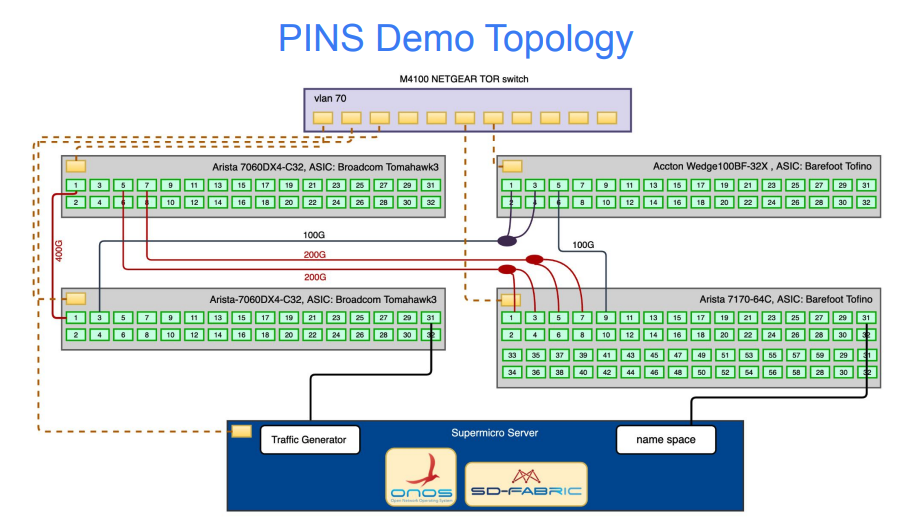

<!--
Copyright 2021-present Open Networking Foundation

SPDX-License-Identifier: Apache-2.0
-->
## Exercise 5 - PINS Fabric Demonstration

PINS launched at the OCP Global Summit in November 2021. If you have not already
watched the [complete video](https://www.youtube.com/watch?v=iZuWdiV9dnc) of the
demonstration, here is a link that jumps to the beginning of the [Weighted Cost
MultiPath (WCMP) Demo](https://www.youtube.com/watch?v=iZuWdiV9dnc&t=271s) (link
starts at 4:43 and lasts 6:18 minutes).

This demonstration brings P4 and SDN to SONiC, using ONOS for a control plane to
manage routes and set up the flow objectives. It is a pure play SDN solution
that uses a multi-purpose L2/L3 leaf-spine switching fabric without traditional
control protocols such as BGP.  The SDN Controller (ONOS) is decoupled from the
data plane and runs the segment routing application that powers Trellis and
SD-Fabric. (Normally, the segment routing application relies on MPLS rules in
the spines, but we use IPv4 routes in this case.) The result is that the fabric
acts as one big router. For more information on the switch pipeline, you can
find the P4 SAI tables here:
[Azure/sonic-pins/sai_p4](https://github.com/Azure/sonic-pins/tree/main/sai_p4/instantiations/google).
The `middleblock.p4` instantiation of the SAI pipeline is close to what we used
for our demonstration.

The PINS demonstration topology is a 2x2 leaf-spine fabric and server(s) with
the following setup:

* 4 PINS switches connected in a 2x2 leaf-spine topology
    * _Spine_: Arista 7060DX4-C32, Broadcom Tomahawk3
    * _Spine_: Accton Wedge100BF-32X, Intel Barefoot Tofino
    * _Leaf_: Arista 7060DX4-C32, Broadcom Tomahawk3
    * _Leaf_: Arista 7170-64C, Intel Barefoot Tofino
* Server:
    * A server (could be a laptop) must run ONOS with access to the management
      network of the switches.
    * Hosts are on the two leaf devices. Instead of physical hosts, network
      namespaces or mac vlan interfaces can emulate hosts on a server. We used
      namespaces in our demo.

### Figure 2 - PINS Demonstration Topology

### Create a PINS Demonstration on Your Network (Advanced)

If you have access to four switches to create this demonstration, you can
download the PINS demonstration software and experiment on your network.

WCMP depends on your network topology. In the future, we will have tools such as
gNMI to determine route weights and enable WCMP. For now, you have to choose the
weights manually, as we did in the demonstration. Then use the config files
found in the demonstration software to achieve WCMP in your network.

There are five folders containing configuration files in this exercise, one for
each switch/ASIC combination and one for ONOS. Each switch needs a
`config_db.json` file. The switches that contain a Broadcom ASIC also require
`port_config.ini` and `*.config.bcm` to implement SAI.

1. `spine-arista-TH3`: Arista 7060DX4-C32, Broadcom Tomahawk3
2. `spine-accton-BF`: Accton Wedge100BF-32X, Intel Barefoot Tofino
3. `leaf-arista-TH3`: Arista 7060DX4-C32, Broadcom Tomahawk3
4. `leaf-arista-BF`: Arista 7170-64C, Intel Barefoot Tofino
5. `onos-topology`: ONOS configuration file, `netconfig.json`, for segment
   routing and gRPC connections (i.e. the P4Runtime connection)

The docker container with ONOS that you got in Exercise 4 has the PINS driver
and SAI pipeliner installed. There are two pipelines in
`org.onosproject.pipelines.sai` and `org.onosproject.pipelines.sai_fixed`. The
latter does not include ACLs. If your topology has other requirements and you
need to create other pipelines, explore the [SONiC ONOS
Driver](https://github.com/pins/sonic-onos-driver) repository, especially the
[loader](https://github.com/pins/sonic-onos-driver/blob/main/pipeliner/src/main/java/org/onosproject/pipelines/sai/SaiPipeconfLoader.java).
You will also need follow the instructions in [Build ONOS with
PINS](../BuildONOSwithPINS) instead of using the docker image we built for you
in Exercise 4.
